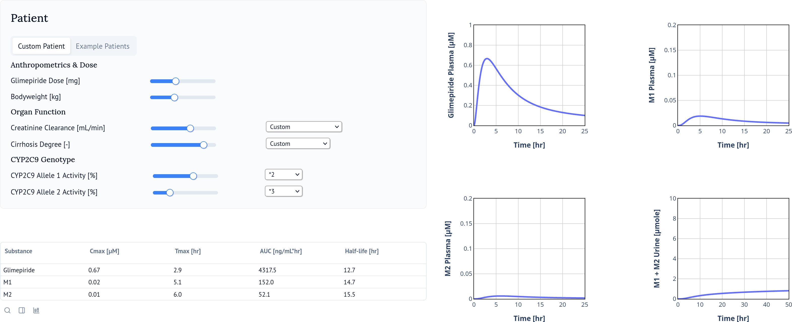

# Glimepiride Web Application "Digital Twin"
This repository contains the code of the digital twin web application of glimepiride available at [https://glimepiride.de](https://glimepiride.de).



The model repository is available from [https://github.com/matthiaskoenig/glimepiride-model.git](https://github.com/matthiaskoenig/glimepiride-model.git).

## Run with docker
```bash
# Build the image
docker build -t glimepiride_app .

# Start the container, mapping port 8080
docker run -p 4567:8080 -it glimepiride_app
```
The app is available from http://localhost:4567


## Run locally
Use `uv` to setup the dependencies
```bash
uv venv
uv sync
```

To run the app locally use
```bash
marimo run src/app.py 
```

To modify the app use
```bash
marimo edit src/app.py
```
## License

* Source Code: [MIT](https://opensource.org/license/MIT)
* Documentation: [CC BY-SA 4.0](https://creativecommons.org/licenses/by-sa/4.0/)
* Models: [CC BY-SA 4.0](https://creativecommons.org/licenses/by-sa/4.0/)

This program is distributed in the hope that it will be useful, but WITHOUT ANY
WARRANTY; without even the implied warranty of MERCHANTABILITY or FITNESS FOR A
PARTICULAR PURPOSE.

Funding
=======
Matthias König was supported by the Federal Ministry of Education and Research (BMBF, Germany) within LiSyM by grant number 031L0054 and ATLAS by grant number 031L0304B and by the German Research Foundation (DFG) within the Research Unit Program FOR 5151 QuaLiPerF (Quantifying Liver Perfusion-Function Relationship in Complex Resection - A Systems Medicine Approach) by grant number 436883643 and by grant number 465194077 (Priority Programme SPP 2311, Subproject SimLivA). This work was supported by the BMBF-funded de.NBI Cloud within the German Network for Bioinformatics Infrastructure (de.NBI) (031A537B, 031A533A, 031A538A, 031A533B, 031A535A, 031A537C, 031A534A, 031A532B). 

© 2024-2025 Michelle Elias & Matthias König, [Systems Medicine of the Liver](https://livermetabolism.com)